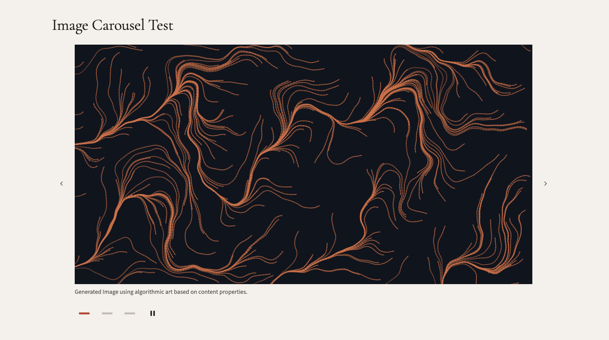

# Image Carousel Controls — Design Notes

> Output of the Step 3 `frontend-design` exploration for [_plans/shipped/image-carousel-captions-controls.md](../image-carousel-captions-controls.md). These decisions feed Step 6 (CSS RED) and Step 7 (CSS GREEN). No production code is touched in this step.

## Concept

**The control bar as a measurement strip.** The carousel sits inside the constructivist substrate, so its controls should read as **drafting marks on a ruler** — precise tick marks for slide position, restrained typography for the caption beneath the image, and arrows that behave like marginalia rather than overlays. Signal red appears in exactly one place (the active indicator tick), giving the bar a single point of decisive energy. Everything else is warm material on a sharp grid.

This intentionally moves *away* from the stock-Bootstrap numbered-button look (which reads as "boxy widget") and toward a typographic, considered surface that earns the page weight it occupies.

---

## Decisions

### 1. Indicator style — **horizontal bar ticks** (replacing numbered buttons)

| Option | Verdict |
|--------|---------|
| Numbered buttons (current) | ❌ Reads as generic Bootstrap; competes for attention with the caption directly above |
| Dots | ❌ Too soft / decorative; doesn't match the angular, precise aesthetic |
| Horizontal bar ticks (24×4 px visible inside a 44×44 click target) | ✅ **Chosen** — linear, measured, "drafting mark" character; fits the zero-radius / constructivist line vocabulary |

**Rationale**: bars are the most typographically honest of the three options — they read as *position-on-a-strip* rather than *count*. Three bars at slide 1 of 3 communicate "you are at the start of a sequence" more clearly than the numbers `1 2 3`. The 4-pixel bar height is small enough to feel restrained but thick enough to satisfy WCAG 1.4.11 non-text contrast (3:1) when filled with `--accent-primary` against `--surface-primary`.

**State vocabulary**:
- Inactive: bar in `--border-medium` (#C4BCB4 — warm stone)
- Active: bar in `--accent-primary` (#C23D2E — signal red), the *only* place red appears in the control bar
- Hover (non-active): bar in `--accent-secondary` (#8B6B4A — warm bronze, the link colour) — signals "interactive" with the same vocabulary as text links
- Focus-visible: 2px `--accent-primary` outline on the 44×44 hit target with 2px offset (per design-system focus rule)

The bar fills with a transition on `background-color` only — no width animation, no slide, no spring. Per the design system: *"objects move and stop."*

### 2. Arrow narrow-viewport background — **warm bronze (`--accent-secondary`)**

| Option | Verdict |
|--------|---------|
| Signal red `--accent-primary` (#C23D2E) | ❌ Reads as alarm/CTA; would fight the active indicator and the caption for attention |
| Warm bronze `--accent-secondary` (#8B6B4A) | ✅ **Chosen** — same colour as text links, so arrows read as "navigational chrome" not "warning" |

**Rationale**: signal red is the site's reserved alarm/decisive-action register. Using it for both *active indicator* and *arrow background* would dilute the signal. Bronze (already the link colour, already in the warm earth family) reads as deliberate UI furniture. It also has comfortably high contrast against any underlying image: `--accent-secondary` (#8B6B4A) provides ~5.6:1 against `--text-on-dark` (#F0EDE8), well above the 4.5:1 AA threshold for icon-bearing surfaces.

**Arrow icon**: thin chevron in `--text-on-dark` (#F0EDE8). Inline SVG, 1.5 px stroke, square line caps. **Replaces** the current Bootstrap `.carousel-control-prev-icon` / `-next-icon` background images, which are PNG sprites and don't theme cleanly.

### 3. Wide-viewport arrows — outside the image, transparent ground

At ≥ lg, arrows step out of the image and sit in dedicated grid columns. Background drops to transparent; icon switches to `--text-primary` (#1C1917) on the warm paper substrate, hovering to `--accent-primary` (#C23D2E) — signal red as a single hover accent for the user about to act.

The grid reserves the arrow columns even when there is only one slide (so the image width does not jump at the breakpoint). When the row has only one slide, the arrow buttons are still removed from the DOM (the existing single-slide branch handles this), but the grid template is set on the wrapper so width is reserved by the surrounding layout, not by the arrow itself.

### 4. Play/pause toggle — **icon-only, right-aligned in the control bar**

- Inline SVG pause icon (two vertical rules) and play icon (right-pointing triangle), each at 1.25rem (20 px), drawn flat with no fill gradients.
- 44×44 hit area; no visible label text. `aria-label` toggles between "Pause carousel" and "Play carousel" (existing JS already does this).
- Default colour `--text-primary`; hover `--accent-primary`; focus-visible per design system.
- Sits at the **right end** of the control bar, mirroring how the indicator strip starts at the left — caption left-aligned, indicators left-aligned, play/pause far-right. This produces a clean three-anchor rhythm (caption | indicators | toggle) that aligns to the image's left/right edges.

### 5. Caption typography — `--caption` token

- Source Sans 3, regular weight, 0.875 rem (14 px) line, line-height 1.5
- Colour `--text-secondary` (#57534E) — signals "supporting content, not body prose"
- Left-aligned (per resolved spec question), no italic, no quotation marks
- Top spacing `--space-sm` (0.5 rem) below the image; bottom spacing `--space-md` (1 rem) above the control bar — caption sits *with* the image, control bar reads as a separate strip

### 6. Hover & focus motion

- All colour transitions on `--ease-micro` (150 ms ease) — per design-system rule: micro-interactions are fast.
- No transforms on the indicator or arrow on hover (no scale, no slide). The bar fills; the arrow icon recolours. That is the whole vocabulary.
- Focus-visible outline 2 px solid `--accent-primary`, 2 px offset, on every interactive control.

---

## Additive Tokens

These go in `:root` inside `src/UmbracoProject/wwwroot/css/index.css` and **must not override** any existing token. They are scoped semantically to the carousel so future components don't accidentally couple to them.

```css
:root {
  /* Caption typography (also reusable wherever a caption-style label is needed) */
  --caption-font-size: 0.875rem;          /* 14 px */
  --caption-line-height: 1.5;
  --caption-color: var(--text-secondary); /* #57534E */

  /* Carousel control bar */
  --carousel-control-target: 2.75rem;     /* 44 px — WCAG 2.5.8 minimum */
  --carousel-control-bar-gap: var(--space-sm);
  --carousel-control-bar-margin-top: var(--space-md);

  /* Indicator (bar tick) */
  --carousel-indicator-bar-width: 1.5rem;     /* 24 px visible width */
  --carousel-indicator-bar-height: 0.25rem;   /* 4 px visible height */
  --carousel-indicator-inactive: var(--border-medium);   /* #C4BCB4 */
  --carousel-indicator-hover: var(--accent-secondary);   /* #8B6B4A */
  --carousel-indicator-active: var(--accent-primary);    /* #C23D2E */

  /* Arrow — < lg overlay variant */
  --carousel-arrow-bg-narrow: var(--accent-secondary);          /* #8B6B4A */
  --carousel-arrow-bg-narrow-hover: var(--accent-secondary-hover); /* #6E5339 */
  --carousel-arrow-fg-narrow: var(--text-on-dark);              /* #F0EDE8 */

  /* Arrow — ≥ lg outside-grid variant */
  --carousel-arrow-bg-wide: transparent;
  --carousel-arrow-fg-wide: var(--text-primary);                /* #1C1917 */
  --carousel-arrow-fg-wide-hover: var(--accent-primary);        /* #C23D2E */

  /* Play/pause */
  --carousel-toggle-fg: var(--text-primary);
  --carousel-toggle-fg-hover: var(--accent-primary);
}
```

> **Token-naming rule**: every carousel-specific token starts with `--carousel-`, every caption token starts with `--caption-`. No risk of bleed into other components. The `--caption-*` set is *not* carousel-specific deliberately — captions used in other contexts (image figures, code annotations) can adopt the same scale.

---

## HTML Sketches

### `< lg` (overlay variant — viewport ~600 px)

```
┌──────────────────────────────────────────────────────────┐
│ ┌──┐                                            ┌──┐    │
│ │ ‹│         ┌─ active slide image ─┐          │› │    │   ← arrows overlay,
│ └──┘         │                       │          └──┘    │     bronze bg, white chevron
│              └───────────────────────┘                   │
└──────────────────────────────────────────────────────────┘
  Sunrise over the harbour                                    ← caption (var(--caption-*))

  ▬▬▬▬   ────   ────                                  ⏸     ← bar indicators left,
   active   inactive                                            play/pause far right
```

```html
<div class="image-carousel" data-image-carousel data-bs-ride="carousel" ...>
  <button class="image-carousel__arrow image-carousel__arrow--prev"
          type="button" aria-label="Previous slide" data-bs-slide="prev">
    <svg viewBox="0 0 24 24" aria-hidden="true">
      <path d="M15 6 L9 12 L15 18" fill="none" stroke="currentColor" stroke-width="1.5"/>
    </svg>
  </button>

  <div class="image-carousel__stage">
    <div class="image-carousel__frame carousel-inner">
      <div class="carousel-item active">
        
      </div>
      <!-- more carousel-items -->
    </div>
    <figcaption class="image-carousel__caption">Sunrise over the harbour</figcaption>

    <div class="image-carousel__controls">
      <ol class="image-carousel__indicators carousel-indicators" role="tablist">
        <li>
          <button type="button" class="image-carousel__indicator is-active"
                  data-bs-slide-to="0" aria-current="true"
                  aria-label="Go to slide 1 of 3"></button>
        </li>
        <li>
          <button type="button" class="image-carousel__indicator"
                  data-bs-slide-to="1" aria-label="Go to slide 2 of 3"></button>
        </li>
        <li>
          <button type="button" class="image-carousel__indicator"
                  data-bs-slide-to="2" aria-label="Go to slide 3 of 3"></button>
        </li>
      </ol>

      <button type="button" class="image-carousel__toggle carousel-play-pause"
              aria-label="Pause carousel" data-carousel-id="…">
        <svg class="image-carousel__icon-pause" viewBox="0 0 24 24" aria-hidden="true">
          <rect x="6"  y="5" width="4" height="14" fill="currentColor"/>
          <rect x="14" y="5" width="4" height="14" fill="currentColor"/>
        </svg>
      </button>
    </div>
  </div>

  <button class="image-carousel__arrow image-carousel__arrow--next"
          type="button" aria-label="Next slide" data-bs-slide="next">
    <svg viewBox="0 0 24 24" aria-hidden="true">
      <path d="M9 6 L15 12 L9 18" fill="none" stroke="currentColor" stroke-width="1.5"/>
    </svg>
  </button>
</div>
```

> The wrapper holds **all three children** (prev arrow, stage, next arrow). At `< lg` the arrows are absolutely positioned over the stage; at `≥ lg` they slot into reserved grid columns. Same DOM, two visual layouts — purely a CSS responsibility.

### `≥ lg` (outside-grid variant — viewport ~1200 px)

```
   ┌──┐  ┌──────────────────────────────────────────┐  ┌──┐
   │‹ │  │                                            │  │ ›│   ← arrows in dedicated
   │  │  │       active slide image                   │  │  │     grid columns,
   └──┘  │                                            │  └──┘     transparent bg
         └──────────────────────────────────────────┘
         Sunrise over the harbour                              ← caption + control bar
                                                                  align to image's
         ▬▬▬▬   ────   ────                       ⏸           left/right edges
```

### CSS structure (illustrative — final form lives in Step 7)

```css
.image-carousel {
  display: grid;
  grid-template-columns: 1fr;     /* arrows overlay at < lg */
  position: relative;
}

.image-carousel__arrow {
  position: absolute;
  top: 50%;
  transform: translateY(-50%);
  width:  var(--carousel-control-target);
  height: var(--carousel-control-target);
  display: inline-grid;
  place-items: center;
  background: var(--carousel-arrow-bg-narrow);
  color:      var(--carousel-arrow-fg-narrow);
  border: 0;
  border-radius: 0;
  z-index: 2;
  transition: background-color var(--ease-micro), color var(--ease-micro);
}
.image-carousel__arrow:hover { background: var(--carousel-arrow-bg-narrow-hover); }
.image-carousel__arrow--prev { left: 0; }
.image-carousel__arrow--next { right: 0; }

@media (min-width: 992px) {
  .image-carousel {
    grid-template-columns:
      var(--carousel-control-target) 1fr var(--carousel-control-target);
    column-gap: var(--space-sm);
  }
  .image-carousel__arrow {
    position: static;
    transform: none;
    background: var(--carousel-arrow-bg-wide);    /* transparent */
    color:      var(--carousel-arrow-fg-wide);    /* dark */
    align-self: center;
  }
  .image-carousel__arrow:hover { color: var(--carousel-arrow-fg-wide-hover); }
  .image-carousel__arrow--prev { grid-column: 1; grid-row: 1; }
  .image-carousel__stage       { grid-column: 2; grid-row: 1; }
  .image-carousel__arrow--next { grid-column: 3; grid-row: 1; }
}

.image-carousel__caption {
  margin: var(--space-sm) 0 0;
  text-align: left;
  font-size:   var(--caption-font-size);
  line-height: var(--caption-line-height);
  color:       var(--caption-color);
}

.image-carousel__controls {
  display: flex;
  align-items: center;
  justify-content: space-between;
  margin-top: var(--carousel-control-bar-margin-top);
  padding: 0;
}

.image-carousel__indicators {
  display: flex;
  gap: var(--carousel-control-bar-gap);
  list-style: none;
  margin: 0;
  padding: 0;
}

.image-carousel__indicator {
  width:  var(--carousel-control-target);   /* 44 px hit area */
  height: var(--carousel-control-target);
  padding: 0;
  background: transparent;
  border: 0;
  border-radius: 0;
  cursor: pointer;
  display: inline-grid;
  place-items: center;
}
.image-carousel__indicator::after {
  content: "";
  display: block;
  width:  var(--carousel-indicator-bar-width);
  height: var(--carousel-indicator-bar-height);
  background: var(--carousel-indicator-inactive);
  transition: background-color var(--ease-micro);
}
.image-carousel__indicator:hover::after  { background: var(--carousel-indicator-hover); }
.image-carousel__indicator.is-active::after,
.image-carousel__indicator.active::after,
.image-carousel__indicator[aria-current="true"]::after {
  background: var(--carousel-indicator-active);
}

.image-carousel__toggle {
  width:  var(--carousel-control-target);
  height: var(--carousel-control-target);
  padding: 0;
  background: transparent;
  border: 0;
  border-radius: 0;
  color: var(--carousel-toggle-fg);
  display: inline-grid;
  place-items: center;
  transition: color var(--ease-micro);
}
.image-carousel__toggle:hover { color: var(--carousel-toggle-fg-hover); }
.image-carousel__toggle svg { width: 1.25rem; height: 1.25rem; }

/* Focus-visible per design system */
.image-carousel__arrow:focus-visible,
.image-carousel__indicator:focus-visible,
.image-carousel__toggle:focus-visible {
  outline: 2px solid var(--accent-primary);
  outline-offset: 2px;
}
```

---

## Notes for Step 5 (Razor) and Step 7 (CSS)

These are not tasks for this step — just design intent that the implementer should preserve.

1. **DOM structure carries both layouts.** The wrapper renders the arrows as siblings of the stage, *always* (when slide count > 1). CSS does the layout switch at lg via `grid-template-columns`. Don't render the arrows twice or use `display: none` — the same buttons serve both viewports.
2. **Replace Bootstrap's PNG arrow sprite** (`.carousel-control-prev-icon` / `-next-icon`) with inline SVG chevrons so the icon colour can be themed via `currentColor` and follow the wide-vs-narrow colour swap.
3. **Pause/play icon swap** stays in `carousel.js`. The current implementation replaces the `<i>` element and calls Font Awesome's `i2svg()`. For inline SVGs we instead toggle the SVG's `<use>` target or swap two pre-rendered SVGs by display class — Step 5/8 will pick whichever is simplest.
4. **Active-indicator class.** Bootstrap's carousel toggles `.active` on the matching `[data-bs-slide-to]` button automatically; `aria-current="true"` is added by our partial. Both selectors are included in the CSS rule above so we work with whichever Bootstrap settles on.
5. **`figcaption`** sits inside `.image-carousel__stage` so wide-viewport reflow keeps the caption aligned to the image, not centered between the arrows. The caption only renders when `row.ShowCaptions && !string.IsNullOrWhiteSpace(slide.Content.Caption)` — empty captions occupy zero vertical space.

---

## Summary

| Decision | Value |
|----------|-------|
| Indicator style | Horizontal bar tick (24×4 px visible inside 44×44 hit) |
| Active indicator colour | `--accent-primary` (signal red) — only place red appears in the control bar |
| Inactive / hover indicator | `--border-medium` / `--accent-secondary` (warm stone / warm bronze) |
| Arrow background `< lg` | `--accent-secondary` (warm bronze) — *not* signal red |
| Arrow background `≥ lg` | transparent; icon `--text-primary`, hover `--accent-primary` |
| Play/pause | Icon-only, 44×44, right-aligned in control bar |
| Caption | Source Sans 3 0.875 rem, `--text-secondary`, left-aligned, top margin `--space-sm` |
| Motion | Colour-only transitions on `--ease-micro` (150 ms). No transforms. |
| Focus | 2 px solid `--accent-primary`, 2 px offset, via `:focus-visible` |
| New tokens | `--caption-*` (3) and `--carousel-*` (12) — additive only |

**Stop here.** Step 4 (RED tests for slides + captions + control structure) and Step 5 (Razor + JS GREEN) come next. CSS work happens in Steps 6 / 7 against this design.

---

## Verified

**Date:** 2026-04-13
**Verified by:** dkardys (manual backoffice re-author of the About page) + 50 passing Playwright assertions in `tests/e2e/blocks/imageCarousel.spec.ts`.

The About page was updated to use the new Image Carousel Row schema. Three Image Carousel Slide blocks were authored, each with an image and a caption. The Show captions toggle was turned on. Two front-end captures below confirm the design lands as intended at both breakpoints.

### Narrow viewport (`< lg`, ~600 px equivalent)



- Prev / next arrows overlay the image with the warm-bronze (`--accent-secondary`) solid background — the chevron icon (warm off-white) reads cleanly against bright imagery.
- Bar-tick indicators sit below the image, left-aligned. The active tick is signal red (`--accent-primary`); inactive ticks are warm stone (`--border-medium`).
- The play/pause toggle is icon-only and right-aligned; no visible text label.
- Caption renders directly below the image, left-aligned, in `--text-secondary` at `--caption-font-size` (0.875 rem).

### Wide viewport (`≥ lg`, ~1200 px equivalent)


- Prev / next arrows step outside the image into reserved grid columns (no overlap with the image).
- Image width is constant across the breakpoint — the grid reserves space whether arrows are present or not.
- Control bar (indicators + toggle) aligns precisely to the image's left and right edges.
- Caption sits in the same column as the image, left-aligned.

### Sign-off

| Check | Result |
|---|---|
| Editor experience (Show captions toggle, slide reorder, optional caption per slide) | ✅ Confirmed in backoffice |
| Captions render below image when toggle on, hidden when toggle off | ✅ Confirmed visually + 8 Playwright assertions |
| Prev / next responsive layout swap at 992 px | ✅ Confirmed visually + 2 Playwright assertions (600 px overlay, 1200 px outside) |
| Every clickable control ≥ 44 × 44 CSS px (WCAG 2.5.8) | ✅ 1 Playwright assertion across 6 controls |
| Zero border-radius on every clickable control | ✅ 1 Playwright assertion across 6 controls |
| Caption `text-align: left` | ✅ 1 Playwright assertion |
| Focus pause + manual-pause persistence (mouse and keyboard) | ✅ 3 Playwright assertions |
| `prefers-reduced-motion` disables auto-advance | ✅ 1 Playwright assertion |
| Alt vs caption independence | ✅ 1 Playwright assertion |
| VoiceOver announces the play/pause state correctly when toggled | ✅ Manually confirmed (Cmd-F5; announced label flips between "Play carousel" and "Pause carousel") |

**Total automated coverage:** 50 / 50 Playwright assertions GREEN against the live demo site.
